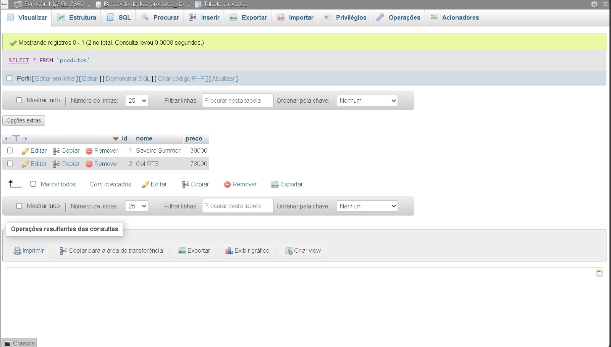
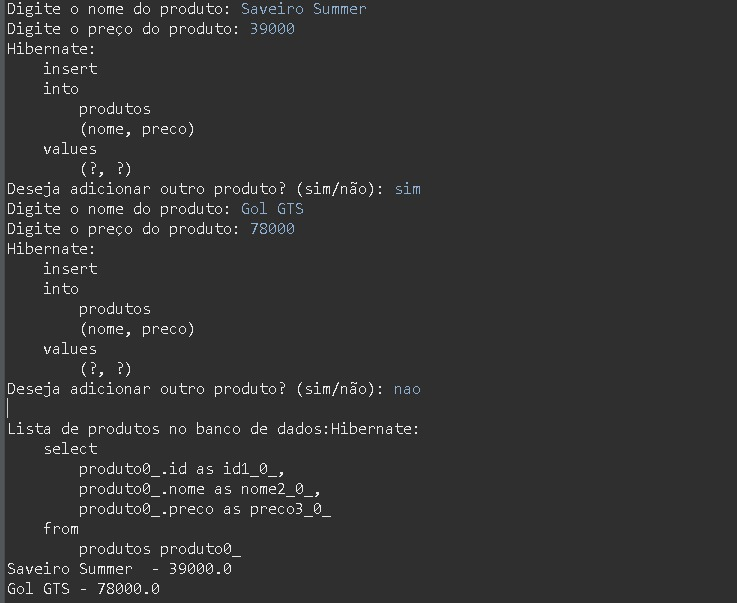

# JPA

Estou amando fazer, feito com atraso, aceito criticas construtivas.

## 🚀 Começando

CRIE UM PROJETO EM JAVA E REPRODUZA O EXEMPLO DO SOBRE O TEMA DA AULA DE JPA;

NO EXEMPLO, SERÁ NECESSÁRIO UTILIZAR O WAMP PARA ACESSO DO BANCO DE DADOS MYSQL, CONFIRA INFORMAÇÕES NO CONTEÚDO DA AULA 11 - WAMP;
APÓS A CONFIGURAÇÃO DO AMBIENTE, CRIAÇÃO DO PROJETO MAVEN E SUAS RESPECTIVAS CLASSES;

AO TÉRMINO CRIE UM REPOSITORIO REMOTO COM NOME JPA:

PARA ENTREGA DENTRO DO README.MD INSIRA AS SEGUINTES IMAGENS:

## 🛠️ Construído com

* IDE Eclipse

## 📌 Versão

* **Versão 1.0**
  
## ✒️ Autores

* **Ryan Rezani** - *JPA*
